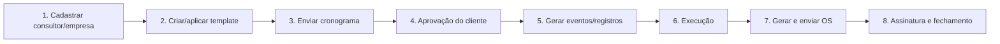

# DOC 01 — Visão Geral do Sistema e Lógica de Negócio

> Documento consolidado a partir de `README.md`, `docs/INDEX.md`, `docs/DOCUMENTACAO_TECNICA.md`, `docs/DOCUMENTACAO_TECNICA_COMPLETA.md`, `docs/MVP_BLUEPRINT.md`, `docs/FLUXO_AGENDAMENTO_IMPLANTACAO.md`, `docs/GUIDA_OPERACIONAL.md`, `docs/DETALHAR_PROCESSO_CRONOGRAMA.md`, `docs/EMAIL_ENVIO.md`, `docs/03_logicas_e_validacoes.md`, `docs/ACCEPTANCE_CHECKLISTS.md`.

## Índice

- [1. Propósito do Sistema](#1-proposito-do-sistema)
  - [1.1 O que o sistema faz](#11-o-que-o-sistema-faz)
  - [1.2 Problema que resolve](#12-problema-que-resolve)
  - [1.3 Público-alvo e contexto de uso](#13-publico-alvo-e-contexto-de-uso)
  - [1.4 Princípio arquitetural orientador](#14-principio-arquitetural-orientador)
- [2. Fluxo de Negócio Principal](#2-fluxo-de-negocio-principal)
  - [2.1 Visão macro (ponta a ponta)](#21-visao-macro-ponta-a-ponta)
  - [2.2 Fluxo detalhado por etapa](#22-fluxo-detalhado-por-etapa)
  - [2.3 Pontos de decisão críticos](#23-pontos-de-decisao-criticos)
- [3. Entidades e Conceitos-Chave](#3-entidades-e-conceitos-chave)
  - [3.1 Entidades principais](#31-entidades-principais)
  - [3.2 Relacionamentos](#32-relacionamentos)
  - [3.3 Glossário de domínio](#33-glossario-de-dominio)
- [4. Casos de Uso Principais](#4-casos-de-uso-principais)
- [5. Regras de Negócio e Validações](#5-regras-de-negocio-e-validacoes)
  - [5.1 Regras de negócio críticas](#51-regras-de-negocio-criticas)
  - [5.2 Validações de entrada (front-end)](#52-validacoes-de-entrada-front-end)
  - [5.3 Validações de consistência (dados)](#53-validacoes-de-consistencia-dados)
  - [5.4 Comportamentos automáticos do sistema](#54-comportamentos-automaticos-do-sistema)
- [6. Estados das Entidades e Transições](#6-estados-das-entidades-e-transicoes)
- [7. Papéis e Permissões](#7-papeis-e-permissoes)
- [8. Métricas de Aceitação (QA)](#8-metricas-de-aceitacao-qa)

---

<a id="1-proposito-do-sistema"></a>

## 1. Propósito do Sistema

### 1.1 O que o sistema faz

O **Faktory Flow Agenda** é uma **SPA (Single Page Application)** que centraliza, em um único fluxo rastreável, todas as operações de uma consultoria:

- Cadastros de **consultores** e **empresas-cliente**.
- Planejamento via **cronogramas** (builder simples e baseados em **templates**).
- Gestão de **agenda** (eventos diários/semanais/mensais com detecção de conflitos).
- Registro de **atendimentos**, **treinamentos** e **tarefas**.
- Emissão, envio e assinatura de **Ordens de Serviço (OS)**.
- Controle de **saldo de horas** por cliente (debitado na emissão da OS).
- **Notificações** automáticas por e-mail e WhatsApp.
- (Opcional) Sincronização com **Microsoft Graph** (Outlook/Teams).

### 1.2 Problema que resolve

Consultorias com múltiplos consultores e clientes sofrem com:

- Planilhas dispersas e retrabalho.
- Falta de visibilidade do status de execução de cada compromisso.
- Pendências esquecidas após treinamentos.
- Cobrança e contabilização de horas pouco rastreáveis.
- Comunicação não padronizada com clientes (cronogramas, OS, aprovações).

O sistema **unifica planejamento, execução e cobrança** em um fluxo único, com rastreabilidade ponta a ponta.

### 1.3 Público-alvo e contexto de uso

| Perfil | Como usa o sistema |
|---|---|
| **Coordenador de Atendimento** | Cadastra consultores/empresas, cria templates, monta e envia cronogramas. |
| **Consultor** | Executa treinamentos, registra horas, marca pendências, gera OS. |
| **Cliente final** | Recebe cronograma para aprovação; assina OS via link público. |
| **Suporte Técnico / Admin** | Configura tabelas auxiliares, audita histórico, gerencia integrações. |

**Cenário típico:** consultoria com até ~10 usuários simultâneos atendendo dezenas de empresas-cliente. Operação interna, não SaaS público.

### 1.4 Princípio arquitetural orientador

> **Zero backend de dados.** Tudo é persistido no `localStorage` do navegador. O backend serverless existe **apenas** para tarefas que exigem segredo (envio SMTP de e-mail). Credenciais nunca tocam o cliente.

Detalhes técnicos completos: ver `DOC_02_ARQUITETURA_E_REFERENCIA_TECNICA.md`.

---

<a id="2-fluxo-de-negocio-principal"></a>

## 2. Fluxo de Negócio Principal

### 2.1 Visão macro (ponta a ponta)

```
Cadastros → Cronograma → Aprovação → Execução → OS → Assinatura → Faturamento
```



### 2.2 Fluxo detalhado por etapa

1. **Cadastro de consultor** *(Coordenador)*
   - Cria registro em `Configuração → Cadastros → Consultores`.
   - Define jornada (`workStart`, `workEnd`), almoço (`lunchMin`), dias livres (`freeDays`), bloqueios (`blockedDates`) e recorrência padrão.
   - **Regra crítica:** capacidade diária = `workEnd − workStart − lunchMin`.

2. **Cadastro de empresa-cliente** *(Coordenador)*
   - Em `Configuração → Cadastros → Empresas → + Nova`.
   - Campos: razão social, fantasia, CNPJ, responsável, e-mail, WhatsApp, `consultantId` padrão, `tipoAgenda`, projeto.
   - **Regra crítica:** sem `Consultor Padrão`, exibir aviso obrigatório antes de gravar.

3. **Inclusão da empresa no Kanban de Atendimentos**
   - Em `Atend./Treino/Tarefas → + Novo cliente` → seleciona empresa → cria `ClientCard` com status inicial `nao-iniciada`.

4. **(Opcional) Criação de template** *(Coordenador)*
   - Em `Templates → + Novo template`.
   - Define itens (`kind` ∈ {treinamento, tarefa}), checklist, `suggestedDays`, `timeStart`/`timeEnd`, prioridade.

5. **Criação do cronograma** *(Coordenador/Consultor)*
   - Em `Cronogramas por empresa → + Novo cronograma`.
   - Modos: **Builder simples** (sugere dias livres) ou **Template V2** (aplica template).
   - Sistema verifica `freeDays`, `blockedDates` e carga diária (`consultantDayLoad`).
   - **Indicadores visuais:** verde = item válido; vermelho = conflito; laranja = provisório.

6. **Envio para aprovação** *(Coordenador)*
   - Botão `Salvar e enviar para aprovação do cliente`.
   - Sistema gera PDF/Excel (via `html2pdf.js`), dispara `POST /api/send-os-email` (ou notificação similar) e marca cronograma como `aguardando-cliente`.
   - **Decisão:** se algum item não tem data/hora, o envio é **bloqueado**.

7. **Aprovação do cliente** *(Cliente)*
   - Cliente clica no link do e-mail → revisa → aprova.
   - Alternativa: consultor clica `Confirmar com cliente` (confirmação verbal).
   - **Operação atômica:** ao confirmar, sistema cria `EVENTS` e `RECORDS` em transação. Falha = nada gravado.

8. **Execução** *(Consultor)*
   - Para cada item: marca `Realizado` / `Não realizado` / `Reagendar` / `Cancelar`.
   - Em treinamentos: preenche checklist, marca tarefas (`Concluída` / `Pendente` / `Cancelada`).
   - **Decisão automática:** treinamento com checklist incompleto **gera tarefa pendente** vinculada.

9. **Geração da Ordem de Serviço (OS)** *(Consultor)*
   - Botão `Gerar OS` em qualquer treinamento/atendimento `atendido`.
   - Preenche título, escopo, participantes, pendências internas, pendências do cliente, horas reais.
   - Sistema preenche automaticamente:
     - Pendências internas ← checklists não concluídas.
     - Pendências do cliente ← tarefas abertas da empresa.

10. **Emissão e envio da OS**
    - PDF gerado client-side (`html2pdf.js`).
    - Envio via SMTP (`/api/send-os-email`) com fallback `mailto:`; opcionalmente WhatsApp (`wa.me`).
    - **Regra crítica:** no envio, `os.status='enviada'` **E** `osDebitHours()` debita o saldo de horas do `ClientCard` (idempotente via flag `hoursDebited`).

11. **Assinatura pelo cliente**
    - Cliente acessa link público (`publicOSLink(osId)`), revisa, desenha assinatura no `<canvas>` nativo.
    - Sistema grava `os.status='assinada'`, `signedAt=now`. Saldo já está debitado.
    - Item de origem (record/event) move para `concluido`.

12. **Cancelamento (se houver)**
    - `osRefundHours()` estorna o saldo se `hoursDebited=true`. Item de origem volta ao status anterior.

13. **Pós-execução**
    - OS alimenta extrato de horas do cliente e do consultor.
    - Dashboard e Kanban refletem status macro automaticamente.

### 2.3 Pontos de decisão críticos

| # | Ponto de decisão | Condição | Consequência |
|---|---|---|---|
| 1 | Envio do cronograma | Todos os itens têm data/hora? | Sim → envia; Não → bloqueia |
| 2 | Aprovação do cliente | Cliente aprovou ou consultor confirmou? | Cria EVENTS+RECORDS atomicamente |
| 3 | Conclusão de treinamento | Checklist completo? | Não → gera tarefa pendente automaticamente |
| 4 | Emissão da OS | `hoursDebited` já está `true`? | Sim → não debita de novo (idempotente) |
| 5 | Cancelamento de OS | `hoursDebited === true`? | Sim → executa estorno via `osRefundHours()` |
| 6 | Reagendamento | Motivo informado? | Não → bloqueia; Sim → cria novo evento com `reagendadoDe` |
| 7 | Edição pós-confirmação | Cronograma já está `confirmado`? | Sim → bloqueia campos validados |
| 8 | Conflito de horário | `findConflicts()` retornou itens? | Bloqueia salvar e sugere alternativas |

---

<a id="3-entidades-e-conceitos-chave"></a>

## 3. Entidades e Conceitos-Chave

### 3.1 Entidades principais

> Convenção de IDs (gerados por `uid(prefix)`): `c_*` consultor, `co_*` empresa, `e_*` evento, `s_*` cronograma, `r_*` registro, `os_*` ordem de serviço, `cc_*` card de cliente. Toda entidade possui `history[]` para auditoria.

| Entidade | Função | Campos-chave |
|---|---|---|
| **CONSULTANTS** | Profissional executor | `name`, `email`, `workStart`/`workEnd`, `lunchMin`, `freeDays[]`, `blockedDates[]`, `defaultRecurrence` |
| **COMPANIES** | Empresa-cliente | `razao`, `fantasia`, `cnpj`, `responsavel`, `contato`(e-mail), `whatsapp`, `consultantId`, `tipoAgenda`, `projeto` |
| **EVENTS** | Compromisso na agenda | `consultantId`, `companyId`, `date`, `timeStart`/`timeEnd`, `typeId`, `status`, `seriesId`, `scheduleId`, `itemId`, `reagendadoDe`, `graphEventId` |
| **SCHEDULES** | Cronograma macro | `companyId`, `consultantId`, `from`/`to`, `status`, `mode`, `items[]`, `eventIds[]` |
| **RECORDS** | Execução operacional | `kind` ∈ {atendimento, treinamento, tarefa}, `date`, `status`, `priority`, `checklist[]`, `linkedTaskIds[]`, `linkedEventId` |
| **TEMPLATES** | Modelo reutilizável | `name`, `items[]` (com `kind`, `checklist`, `suggestedDays`, `timeStart`/`End`, `priority`) |
| **CLIENT_CARDS** | Card no Kanban | `companyId`, `status`, `statusManual`, `hoursContracted`, `hoursLog[]` |
| **ORDERS_SERVICE** | Ordem de Serviço | `itemSrc`, `itemId`, `title`, `scope`, `clientEmail`, `clientWhatsapp`, `internalPending[]`, `clientPending[]`, `status`, `sentAt`, `signedAt`, `hoursDebited`, `hoursDebitedAmount` |
| **NOTIFICATIONS_LOG** | Histórico de envios | `type`, `to`, `via`, `payload`, `sentAt`, `status` |
| **USERS / DASH_VIEWS** | Perfis e filtros salvos | Perfis: `admin`, `editor`, `confirmador`, `visualizador` |
| Auxiliares | Tabelas de apoio | `EVENT_TYPES`, `STATUSES`, `PERIODS`, `RECURRENCES`, `PRIORITIES` |

### 3.2 Relacionamentos

```
COMPANIES 1───* EVENTS *───1 CONSULTANTS
COMPANIES 1───* SCHEDULES *───1 CONSULTANTS
SCHEDULES 1───* EVENTS    (via scheduleId/seriesId/itemId)
SCHEDULES 1───* RECORDS   (gerados na confirmação)
RECORDS   1───* ORDERS_SERVICE  (itemSrc='record')
EVENTS    1───* ORDERS_SERVICE  (itemSrc='event')
COMPANIES 1───1 CLIENT_CARDS
TEMPLATES 1───* SCHEDULES (via items[])
RECORDS   *───* TASKS     (via linkedTaskIds[])
EVENTS    1───1 EVENTS    (reagendadoDe)
ORDERS_SERVICE 1───* NOTIFICATIONS_LOG
```

### 3.3 Glossário de domínio

| Termo | Definição |
|---|---|
| **Cronograma** | Sequência planejada de treinamentos/tarefas para um cliente, em um período. |
| **Template** | Modelo reutilizável de itens que populam um cronograma. |
| **Item de cronograma** | Treinamento ou tarefa pertencente a um cronograma. |
| **Treinamento** | Sessão de transferência de conhecimento, com checklist obrigatório. |
| **Atendimento** | Execução pontual (vinculada a treinamento ou avulsa); pode gerar OS. |
| **Tarefa** | Subitem com status próprio (`Open` → `Pending` → `Done`/`Cancelled`); vinculada normalmente a um treinamento. |
| **OS (Ordem de Serviço)** | Documento que finaliza a execução, contabiliza horas e materializa cobrança. |
| **Saldo de horas (card do cliente)** | Banco de horas contratadas pelo cliente; debitado na emissão de OS. |
| **Reagendamento** | Cancela o evento original e cria um novo, mantendo vínculo `reagendadoDe`. |
| **Capacidade diária** | `workEnd − workStart − lunchMin` (em minutos). |
| **Conflito (double booking)** | Sobreposição de horários do mesmo consultor. |
| **Provisório** | Estado intermediário antes da aprovação do cliente. |
| **Idempotência** | Operação que, repetida, não altera o resultado (ex.: débito de horas via flag). |

---

<a id="4-casos-de-uso-principais"></a>

## 4. Casos de Uso Principais

### UC-01 — Cadastrar Consultor
- **Ator:** Coordenador.
- **Pré-condição:** Usuário autenticado com perfil `admin`/`coordenador`.
- **Fluxo:** Acessa `Configuração → Cadastros → Consultores → + Novo` → preenche identificação, jornada, almoço, dias livres → salva.
- **Pós-condição:** Consultor disponível para vincular a empresas, cronogramas e eventos.

### UC-02 — Cadastrar Empresa-Cliente
- **Ator:** Coordenador.
- **Pré-condição:** Existe ao menos um consultor cadastrado (para `Consultor Padrão`).
- **Fluxo:** `Configuração → Cadastros → Empresas → + Nova` → preenche razão, CNPJ, contatos, consultor padrão, tipo de agenda → salva.
- **Pós-condição:** Empresa disponível para ser adicionada ao Kanban e receber cronogramas.

### UC-03 — Criar Cronograma a partir de Template
- **Ator:** Coordenador ou Consultor.
- **Pré-condição:** Empresa e consultor cadastrados; ao menos 1 template ativo.
- **Fluxo:** `Cronogramas → + Novo cronograma` → seleciona empresa, consultor, período → `Usar templates` → ajusta datas (manual ou `Distribuir nos dias livres`) → valida (verde) → `Salvar rascunho` ou `Enviar para aprovação`.
- **Pós-condição:** Cronograma criado com status `rascunho` ou `aguardando-cliente`.

### UC-04 — Aprovar Cronograma (Cliente)
- **Ator:** Cliente final (ou Consultor via `Confirmar com cliente`).
- **Pré-condição:** Cronograma `aguardando-cliente`, todos os itens com data/hora.
- **Fluxo:** Cliente abre link do e-mail → revisa → confirma. Sistema executa transação atômica que cria `EVENTS` e `RECORDS` para cada item.
- **Pós-condição:** Cronograma `confirmado` e bloqueado para edição. Eventos visíveis na agenda; registros prontos para execução. Card do cliente movido para `em-andamento`.

### UC-05 — Detectar Conflito de Agenda
- **Ator:** Sistema (`findConflicts()`).
- **Pré-condição:** Tentativa de criar/editar evento ou item de cronograma.
- **Fluxo:** Sistema cruza data/hora do novo item com `EVENTS` existentes do consultor e com `blockedDates`/`freeDays`. Se houver sobreposição ou fora-de-jornada, retorna lista de conflitos.
- **Pós-condição:** UI bloqueia salvar, marca item em vermelho e sugere `Sugerir dias livres`.

### UC-06 — Executar Treinamento e Preencher Checklist
- **Ator:** Consultor.
- **Pré-condição:** Registro de treinamento em `em-andamento` ou `em-atendimento`.
- **Fluxo:** Abre o registro → preenche checklist (Concluída/Pendente/Cancelada) → marca treinamento como `Realizado`.
- **Pós-condição:** Status do registro vai para `atendido`. Se houver checklist incompleta → sistema cria **tarefa pendente** vinculada automaticamente.

### UC-07 — Reagendar Evento
- **Ator:** Consultor.
- **Pré-condição:** Evento existente no estado `criado`/`provisorio`/`confirmado`.
- **Fluxo:** Abre evento → `Reagendar` → informa motivo + nova data/hora → salva.
- **Pós-condição:** Evento original recebe status `reagendado`; novo evento criado com `reagendadoDe` apontando ao original. Notificação disparada.

### UC-08 — Gerar Ordem de Serviço (OS)
- **Ator:** Consultor.
- **Pré-condição:** Registro/evento em `atendido`.
- **Fluxo:** Clica `Gerar OS` no item → preenche título, escopo, participantes, horas reais → sistema preenche `internalPending` (checklist não concluído) e `clientPending` (tarefas abertas do cliente) → salva como `rascunho`.
- **Pós-condição:** OS criada (`status=rascunho`), pronta para envio.

### UC-09 — Enviar OS por E-mail e Debitar Saldo
- **Ator:** Consultor.
- **Pré-condição:** OS em `rascunho` com `clientEmail` válido.
- **Fluxo:** Clica `Enviar` → front gera PDF (`html2pdf.js`) → `POST /api/send-os-email` → em caso de falha, fallback `mailto:` → `osDebitHours()` debita `ClientCard.hoursLog` e marca `hoursDebited=true`.
- **Pós-condição:** OS `enviada`, registro em `NOTIFICATIONS_LOG`, saldo do cliente debitado uma única vez (idempotente).

### UC-10 — Assinar OS via Link Público (Cliente)
- **Ator:** Cliente final.
- **Pré-condição:** OS `enviada` com link `publicOSLink(osId)`.
- **Fluxo:** Cliente acessa link → revisa OS → desenha assinatura no `<canvas>` → confirma.
- **Pós-condição:** `os.status=assinada`, `signedAt=now`. Item de origem (`itemSrc`/`itemId`) move para `concluido`. Card do cliente atualiza status macro.

### UC-11 — Cancelar OS com Estorno de Horas
- **Ator:** Coordenador.
- **Pré-condição:** OS em `enviada` (ainda não assinada).
- **Fluxo:** Abre OS → `Cancelar` → confirma motivo → sistema verifica `hoursDebited` → se `true`, executa `osRefundHours()` → status vira `cancelada` → item de origem retorna ao status anterior.
- **Pós-condição:** Saldo estornado (idempotente), histórico registra cancelamento.

### UC-12 — Sincronizar Evento com Microsoft Graph (opcional)
- **Ator:** Consultor (autenticado via MSAL/PKCE).
- **Pré-condição:** App registrado no Entra ID; usuário fez login na integração.
- **Fluxo:** Ao criar/editar/excluir evento, sistema chama `teamsSync(action, ev)` que executa a operação correspondente no calendário Outlook/Teams do usuário; grava `graphEventId` no evento local.
- **Pós-condição:** Evento replicado na conta Microsoft. Se a integração falhar, toast amarelo "Teams não sincronizou" — agenda local intacta.

---

<a id="5-regras-de-negocio-e-validacoes"></a>

## 5. Regras de Negócio e Validações

### 5.1 Regras de negócio críticas

| # | Regra | Intenção |
|---|---|---|
| R-01 | Eventos `cancelado` e `reagendado` não aparecem na agenda padrão | Reduzir poluição visual; manter foco em compromissos válidos |
| R-02 | Atendimento não pode ir direto para "concluído" — apenas via OS | OS é o documento oficial de fechamento |
| R-03 | Treinamento concluído com checklist incompleto **gera tarefa pendente** automaticamente | Garantir que pendências não se percam |
| R-04 | Cronograma `confirmado` bloqueia edição dos campos validados | Manter integridade com o cliente |
| R-05 | Reagendamento exige motivo e cria vínculo `reagendadoDe` no novo evento | Rastreabilidade total |
| R-06 | Capacidade diária do consultor = `workEnd − workStart − lunchMin` | Evitar sobrecarga |
| R-07 | Recorrências semanais/quinzenais/mensais geram no máximo **N=5** ocorrências adicionais | Evitar explosão de eventos |
| R-08 | **Débito de horas acontece na EMISSÃO da OS, não na assinatura** | Reservar saldo já no compromisso firmado |
| R-09 | Débito é **idempotente** via flag `hoursDebited` | Permite chamar de múltiplos pontos sem dobrar |
| R-10 | Cancelamento de OS dispara `osRefundHours()` automaticamente se debitada | Saldo nunca fica "preso" |
| R-11 | Assinatura da OS move `itemSrc`/`itemId` para `concluido` | Formaliza encerramento |
| R-12 | Card do cliente atualiza status macro automaticamente conforme registros | Visão executiva sem ação manual |
| R-13 | Treinamento precisa ter data e horário para envio ao cliente | Evitar cronograma inviável |
| R-14 | Itens sem data podem ficar marcados como "aguardando agendar" | Permitir cronograma parcial em rascunho |
| R-15 | Transições de status seguem `STATUS_TRANSITIONS` e são validadas por `canTransitionTo` | Coerência do ciclo de vida |
| R-16 | OS preenche `internalPending` e `clientPending` automaticamente a partir de checklists/tarefas | Padronizar fechamento |
| R-17 | Sem `Consultor Padrão` na empresa → exibir aviso obrigatório | Evitar criação de cronograma órfão |

### 5.2 Validações de entrada (front-end)

| Validação | Aplicação | Mensagem/efeito |
|---|---|---|
| `timeStart < timeEnd` | Eventos, registros, cronogramas | Bloqueia salvar |
| Campos obrigatórios preenchidos | Todos os formulários | Realça campo em vermelho |
| Formato de CNPJ válido | Empresas | Valida dígitos |
| E-mail com formato válido | Empresas, OS, notificações | Bloqueia envio |
| Checklist completo ao concluir treinamento | Registros tipo `treinamento` | Permite concluir mas gera tarefa pendente |
| `findConflicts()` retorna vazio | Agenda e builder de cronograma | Item em vermelho + tooltip do motivo |
| Disponibilidade respeitada (`freeDays`, `blockedDates`, jornada) | Builder de cronograma | Bloqueia ou sugere alternativa |
| Recorrência respeita limite N=5 | Eventos recorrentes | Trunca silenciosamente |

### 5.3 Validações de consistência (dados)

| Validação | Função | Quando ocorre |
|---|---|---|
| Detecção de órfãos no `localStorage` | `validateDataIntegrity()` | No `loadPersisted()` e sob demanda |
| Migração versionada do schema | `persist()` / `loadPersisted()` (V2 → V3 → V4 → V5) | Carregamento do app |
| Idempotência de envio de OS/notificações | Flags `hoursDebited`, IDs únicos | Re-envio acidental |
| Timezone | Armazenar em UTC, exibir no fuso do usuário | Persistência e renderização |
| Atomicidade na confirmação de cronograma | Transação local commit/rollback | Aprovação do cliente |

### 5.4 Comportamentos automáticos do sistema

| Gatilho | Efeito automático |
|---|---|
| Confirmação de cronograma | Cria `EVENTS` + `RECORDS` para cada item; muda card do cliente para `em-andamento` |
| Treinamento concluído com checklist incompleto | Gera tarefa pendente vinculada (`linkedTaskIds`) |
| Envio de OS | Marca `os.status=enviada`, debita saldo (`osDebitHours`), grava `NOTIFICATIONS_LOG` |
| Assinatura de OS | Marca `os.status=assinada`, move `itemSrc` para `concluido` |
| Cancelamento de OS debitada | Executa `osRefundHours()` automaticamente |
| Mudança de status de registro | Recalcula status macro do `ClientCard` |
| Falha de envio de e-mail | Registra `status=error` no `NOTIFICATIONS_LOG`; UI exibe fallback `mailto:` |
| Reagendamento | Cancela evento original; cria novo com `reagendadoDe`; notifica |

---

<a id="6-estados-das-entidades-e-transicoes"></a>

## 6. Estados das Entidades e Transições

Estados válidos por entidade (validados pela tabela `STATUS_TRANSITIONS` via `canTransitionTo(from, to)`):

| Entidade | Estados possíveis | Estados terminais |
|---|---|---|
| **Evento** | `criado` → `provisorio` → `confirmado` → `em-atendimento` → `atendido` | `reagendado`, `cancelado` |
| **Cronograma** | `rascunho` → `aguardando-cliente` → `confirmado` | (cancelado) |
| **Registro** | `em-andamento` → `pendente` → `em-atendimento` → `atendido` → `concluido` | (cancelado) |
| **OS** | `rascunho` → `enviada` → `assinada` | `cancelada` |
| **ClientCard** | `nao-iniciada` → `aguardando` → `em-andamento` → `concluida` | `cancelada` |
| **Notificação** | `success` ou `error` | (terminais) |
| **Tarefa** | `Open` → `Pending` → `Done` | `Cancelled` |

**Princípio:** saltos ilegais entre estados são bloqueados pelo sistema (ex.: não é possível ir de `criado` direto para `atendido` sem passar por `em-atendimento`).

---

<a id="7-papeis-e-permissoes"></a>

## 7. Papéis e Permissões

| Perfil | Ações principais |
|---|---|
| **admin** | Acesso total: configurações, cadastros, cronogramas, OS, integrações |
| **editor / coordenador** | Cadastra consultor/empresa, cria/edita templates e cronogramas, envia OS |
| **confirmador / consultor** | Executa registros, atualiza checklists, gera OS, reagenda |
| **visualizador** | Apenas leitura: dashboards, agenda, status |
| **cliente final** | Aprovação de cronograma e assinatura de OS via link público (não autenticado no app) |

---

<a id="8-metricas-de-aceitacao-qa"></a>

## 8. Métricas de Aceitação (QA)

Checklists consolidados de `docs/ACCEPTANCE_CHECKLISTS.md`:

**Dashboard**
- Filtros salvos (`DASH_VIEWS`) carregam corretamente.
- Métricas de clientes/OS/treinamentos batem com os dados.

**Agenda**
- Validar `timeStart < timeEnd`.
- `findConflicts` detecta sobreposições.
- Persistência mantém evento na vista correta (mês/semana/dia).

**Cronogramas**
- Sugestão de datas considera `freeDays` + `blockedDates` + carga diária.
- Geração de PDF/Excel anexo funcional.
- Após aprovação, edição bloqueada e eventos gerados atomicamente.

**Registros**
- Checklist persistente em treinamentos.
- Conclusão atualiza status e contabiliza horas.
- Checklist incompleto gera tarefa pendente.

**OS**
- PDF contém horas detalhadas por item.
- Envio registra entrada em `NOTIFICATIONS_LOG`.
- `hoursDebited` previne dobra de débito.
- Cancelamento executa `osRefundHours()`.

**Templates**
- Itens com `suggestedDays` aparecem no builder.

**Integridade**
- `validateDataIntegrity()` sem órfãos críticos após migração de versão.
- `persist()` / `loadPersisted()` preservam versão.

---

> **Próximo documento:** ver `DOC_02_ARQUITETURA_E_REFERENCIA_TECNICA.md` para detalhes técnicos (stack, arquitetura, modelo de dados relacional, integrações, fluxo de código, decisões e roteiro de reconstrução).
