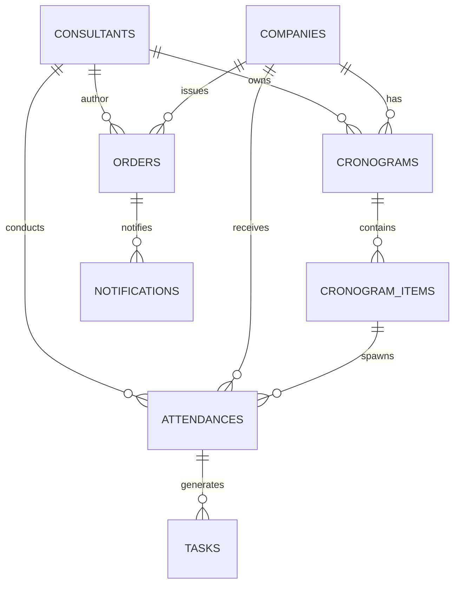

# DOC 02 — Arquitetura e Referência Técnica

> Documento consolidado a partir de `docs/DOCUMENTACAO_TECNICA.md`, `docs/DOCUMENTACAO_TECNICA_COMPLETA.md`, `docs/MVP_BLUEPRINT.md`, `docs/01_visual_e_estilos.md`, `docs/02_componentes_utilizados.md`, `docs/03_logicas_e_validacoes.md`, `docs/04_fluxo_codigo_geral.md`, `docs/08_estrutura_banco_de_dados.md`, `docs/09_estrutura_banco_de_dados.md`, `docs/EMAIL_ENVIO.md`, `package.json`, `vercel.json`, `api/send-os-email.js`.

## Índice

- [1. Stack e Tecnologias](#1-stack-e-tecnologias)
- [2. Arquitetura Geral](#2-arquitetura-geral)
  - [2.1 Diagrama de alto nível](#21-diagrama-de-alto-nivel)
  - [2.2 Separação de responsabilidades](#22-separacao-de-responsabilidades)
  - [2.3 Padrões arquiteturais](#23-padroes-arquiteturais)
- [3. Estrutura de Pastas](#3-estrutura-de-pastas)
- [4. Front-end (SPA)](#4-front-end-spa)
  - [4.1 Páginas e views](#41-paginas-e-views)
  - [4.2 Componentes reutilizáveis](#42-componentes-reutilizaveis)
  - [4.3 Estado global e persistência](#43-estado-global-e-persistencia)
  - [4.4 Lógica de disponibilidade e conflito](#44-logica-de-disponibilidade-e-conflito)
  - [4.5 Geração de PDF e assinatura](#45-geracao-de-pdf-e-assinatura)
  - [4.6 Visual e tokens de design](#46-visual-e-tokens-de-design)
- [5. Back-end (Serverless)](#5-back-end-serverless)
  - [5.1 Função `/api/send-os-email`](#51-funcao-apisend-os-email)
  - [5.2 Validações, rate limit e idempotência](#52-validacoes-rate-limit-e-idempotencia)
- [6. Modelo de Dados](#6-modelo-de-dados)
  - [6.1 Modelo atual (localStorage)](#61-modelo-atual-localstorage)
  - [6.2 Modelo NoSQL sugerido (Firestore)](#62-modelo-nosql-sugerido-firestore)
  - [6.3 Modelo relacional sugerido (Postgres)](#63-modelo-relacional-sugerido-postgres)
  - [6.4 Índices recomendados](#64-indices-recomendados)
  - [6.5 Consultas comuns](#65-consultas-comuns)
- [7. Integrações Externas](#7-integracoes-externas)
  - [7.1 Envio de e-mail (SMTP/transacional)](#71-envio-de-e-mail-smtptransacional)
  - [7.2 Microsoft Graph (MSAL)](#72-microsoft-graph-msal)
  - [7.3 html2pdf.js](#73-html2pdfjs)
  - [7.4 WhatsApp (wa.me)](#74-whatsapp-wame)
- [8. Fluxo de Código e Comunicação entre Módulos](#8-fluxo-de-codigo-e-comunicacao-entre-modulos)
- [9. Requisitos Não Funcionais](#9-requisitos-nao-funcionais)
- [10. Endpoints REST Sugeridos](#10-endpoints-rest-sugeridos)
- [11. Decisões Técnicas e Trade-offs](#11-decisoes-tecnicas-e-trade-offs)
- [12. Limitações, Riscos e Melhorias](#12-limitacoes-riscos-e-melhorias)
- [13. Roteiro de Reconstrução do Zero](#13-roteiro-de-reconstrucao-do-zero)
- [14. Setup, Execução e Deploy](#14-setup-execucao-e-deploy)

---

<a id="1-stack-e-tecnologias"></a>

## 1. Stack e Tecnologias

| Camada | Tecnologia | Versão | Motivo |
|---|---|---|---|
| Front-end | HTML/CSS/JS puro (single-file `index.html`) | — | Zero build, deploy estático, edição direta |
| Persistência local | `localStorage` (chave `atelier_agenda_v2`) | — | Offline, custo zero, simples |
| PDF client-side | `html2pdf.js` (CDN) | latest | Sem backend de documentos |
| Auth Microsoft | `@azure/msal-browser` (CDN) | v2.38+ | PKCE público, sem servidor OAuth |
| Assinatura digital | `<canvas>` nativo + base64 PNG | — | Sem dependência externa |
| Serverless runtime | Node | ≥ 18 | LTS |
| SMTP | `nodemailer` | `^6.9.16` | Padrão de fato no Node |
| Deploy de exemplo | Vercel (`vercel.json` incluído) | — | Functions + estático |
| Scripts | `npm run dev` = `vercel dev`; `npm run deploy` = `vercel --prod` | — | Dev local com função serverless |

**Engines:** `node >= 18.0.0` (`package.json`).

**Alternativas válidas:** Vite + React, Next.js + Prisma + Postgres — porém só ganham modularidade ao custo de toolchain/build/deploy mais lentos. Para uso interno com ≤ 10 usuários simultâneos, o stack flat é superior.

---

<a id="2-arquitetura-geral"></a>

## 2. Arquitetura Geral

### 2.1 Diagrama de alto nível

```
┌───────────────────────────────────────────────────┐
│                 Browser (SPA)                     │
│  ┌─────────────────────────────────────────────┐  │
│  │  index.html                                 │  │
│  │  ├─ state (objeto global)                   │  │
│  │  ├─ arrays: EVENTS, RECORDS, OS, ...        │  │
│  │  ├─ render*() (DOM manual)                  │  │
│  │  └─ persist() → localStorage                │  │
│  └─────────────────────────────────────────────┘  │
│         │                  │              │       │
│         ▼                  ▼              ▼       │
│   localStorage         MSAL.js        html2pdf    │
└─────────│──────────────────│──────────────────────┘
          │                  │
          ▼                  ▼
   /api/send-os-email   Microsoft Graph
          │                  │
          ▼                  ▼
        SMTP            Outlook/Teams
```

### 2.2 Separação de responsabilidades

| Camada | Componentes | Responsabilidade |
|---|---|---|
| **Front-end** | `index.html` | UI, regras de negócio, persistência local, geração de PDF, validações, sync MS Graph |
| **Back-end** | `api/send-os-email.js` (serverless) | Envio SMTP com segredos, validação de payload, rate limit |
| **Serviços externos** | SMTP, Microsoft Graph | Transporte de e-mail; sync de agenda |

> **Crítico:** todas as regras de negócio vivem no front. O backend não tem banco — existe **só** porque credenciais SMTP não podem ficar no navegador.

### 2.3 Padrões arquiteturais

| Padrão | Descrição | Motivo |
|---|---|---|
| **SPA single-file** | Tudo em um `index.html` (~22k linhas) | Deploy estático simples |
| **Estado global mutável** | Objeto `state` + arrays (`EVENTS`, `RECORDS`, etc.) | Sem Redux/MobX; controle direto |
| **Renderização manual** | Funções `renderX()` atualizam DOM idempotentemente | Sem framework reativo |
| **Persistência versionada** | `persist_v2`, `v3`, `v4`, `v5` com migração suave | Evolução sem quebrar dados antigos |
| **Auditoria via `history[]`** | Array em cada entidade | Rastreabilidade barata |
| **Override incremental V2/V3/V4/V5** | Funções estendem versões anteriores | Evolução incremental controlada |
| **Idempotência por flag** | `hoursDebited` em OS | Permite chamar de múltiplos pontos |

---

<a id="3-estrutura-de-pastas"></a>

## 3. Estrutura de Pastas

```
.
├── index.html                          # SPA completa: UI + lógica + estado + persistência
├── api/
│   └── send-os-email.js                # Função serverless: envio SMTP
├── docs/                               # Documentação técnica e operacional (consolidada aqui)
├── package.json                        # Deps: nodemailer; scripts dev/deploy
├── vercel.json                         # Configuração de exemplo (Vercel)
└── README.md                           # Onboarding inicial
```

| Caminho | Responsabilidade |
|---|---|
| `index.html` | Núcleo absoluto: HTML, CSS, JS, regras de negócio, persistência |
| `api/send-os-email.js` | Exemplo de implementação de envio (modelo para produção) |
| `vercel.json` | `cleanUrls: true`, headers `no-store` para `/api/*`, timeout `15s` para a função de envio |
| `package.json` | `type: "module"`, Node ≥ 18, scripts `vercel dev`/`vercel --prod` |

---

<a id="4-front-end-spa"></a>

## 4. Front-end (SPA)

### 4.1 Páginas e views

| View | Objetivo |
|---|---|
| **Dashboard** | Visão operacional consolidada (lista, kanban, calendário) |
| **Agenda** | Calendário mensal/semanal/diário, eventos, conflitos |
| **Cronogramas** | Builder simples ou template V2; aprovação e bloqueio |
| **Registros** | Execução de atendimentos, treinamentos e tarefas |
| **Cadastros** | Consultores, empresas, tabelas auxiliares, templates |
| **Painel do Consultor** | Visão individual |

**Layout:** sidebar (`OPERAÇÃO` / `CONFIGURAÇÃO`) + header + área principal + modais.

**Modais principais:** Evento, Agenda detalhada, Cronograma, Registro, Reagendamento, Template, Hub de item, Ordem de Serviço, Log de notificações.

### 4.2 Componentes reutilizáveis

| Componente | Função |
|---|---|
| `SidebarMenu` | Navegação lateral com seções e badge counts |
| `Header` | Título + ações globais + identificação |
| `CardResumo` | Totais (itens, treinamentos, tarefas, pendências) |
| `KanbanBoard` / `KanbanColumn` | Containers do Kanban por cliente |
| `ClientCard` | Cartão do cliente no Kanban |
| `CronogramaBuilder` | Seleção de período + templates + preview |
| `CronogramaItemEditor` | Modal/drawer para editar data/hora/recursos |
| `TemplateCard` | Exibição de template com ações |
| `ModalForm` | Genérico para formulários |
| `DatePicker` / `TimePicker` | Suporta multi-select para distribuição |
| `BadgeStatus` | Status colorido (Provisório, Em andamento, Confirmado, Cancelado) |
| `TasksChecklist` | Lista com ações rápidas (Concluir, Pendência, Cancelar) |
| `OSForm` | Preencher OS e enviar anexos |
| `NotificationToast` | Feedback assíncrono |

### 4.3 Estado global e persistência

**Objeto `state` — campos principais:**

| Campo | Função |
|---|---|
| `view`, `calView` | View atual e tipo de calendário |
| `viewYear`, `viewMonth`, `viewWeekStart`, `viewDay` | Navegação |
| `filters`, `regFilters`, `dashFilters` | Filtros por módulo |
| `evSelectedDates`, `evStatus`, `evEditingId` | Seleção e edição de eventos |
| `croPreview`, `croTplItems`, `croDraftScheduleId` | Contexto de cronogramas |
| `tplEditing`, `tplPickerMonth`, `tplPickerYear` | Estado de templates |
| `osDraft`, `osEditingId`, `osContext` | Contexto de OS |

**Persistência:**

| Elemento | Descrição |
|---|---|
| Chave | `atelier_agenda_v2` no `localStorage` |
| `persist()` | Serializa `state` + arrays de entidades |
| `loadPersisted()` | Carrega versões antigas e aplica migrações (V2 → V5) |
| `validateDataIntegrity()` | Detecta e corrige órfãos (registros sem empresa/consultor, etc.) |

### 4.4 Lógica de disponibilidade e conflito

| Função | Papel |
|---|---|
| `consultantDailyCapacityMin()` | Capacidade em minutos = `workEnd − workStart − lunchMin` |
| `consultantDayLoad()` | Soma da carga diária ocupada |
| `isConsultantFreeOn()` | Valida disponibilidade considerando `freeDays` e `blockedDates` |
| `findConflicts()` | Detecta sobreposição de horários do mesmo consultor |
| `canTransitionTo(from, to)` | Valida transição contra `STATUS_TRANSITIONS` |

**Recorrências:** semanal, quinzenal e mensal — limitadas a **N=5** ocorrências adicionais para evitar explosão.

### 4.5 Geração de PDF e assinatura

- **PDF:** `html2pdf.js` via CDN; render no browser; sem backend.
- **Assinatura:** `<canvas>` nativo → base64 PNG embutido na OS; link público de assinatura via `publicOSLink(osId)`.

### 4.6 Visual e tokens de design

**Paleta semântica:**

| Cor | Significado |
|---|---|
| Verde | Confirmado / realizado |
| Laranja / Amarelo | Provisório / aguardando aprovação |
| Vermelho | Erro / conflito |
| Azul | Confirmado / em andamento |

**Tokens recomendados para design system:** cores, espaçamentos, tipografia, bordas, sombras.

**Fontes Faktory:** Fraunces + Manrope (substituir em forks).

---

<a id="5-back-end-serverless"></a>

## 5. Back-end (Serverless)

### 5.1 Função `/api/send-os-email`

Implementação de referência em `api/send-os-email.js`. Configurada em `vercel.json` com `maxDuration: 15s`.

**Fluxo:**

1. Front gera HTML/PDF da OS.
2. Front dispara `POST /api/send-os-email` com payload `{ to, subject, html|text, ... }`.
3. Função valida payload, prepara `nodemailer`, dispara envio ao provedor SMTP/transacional.
4. Em sucesso: retorna `200` + id de envio.
5. Em falha: front cai para fallback `mailto:` (abre cliente de e-mail local).
6. Resultado registrado em `NOTIFICATIONS_LOG`.

### 5.2 Validações, rate limit e idempotência

| Garantia | Implementação |
|---|---|
| Validação | Servidor valida `to`, `subject`, `html`/`text` mínimos |
| Rate limit | Limite simples por IP (best-effort) |
| Idempotência | Flags/IDs evitam duplicação em re-submits |
| Timeout | Curto (15s); operações longas devem virar jobs assíncronos |
| Logs | Registrado em `NOTIFICATIONS_LOG` no `localStorage`; idealmente espelhar em backend de logs |

**Boas práticas operacionais:**

- Credenciais SMTP **nunca** em arquivos públicos — usar secrets do provedor (ex.: Vercel env vars, Vault).
- Em produção em escala: provedores transacionais (SendGrid, Postmark, Resend) + SPF/DKIM/DMARC no DNS.
- Monitorar fila de falhas + retries exponenciais.

---

<a id="6-modelo-de-dados"></a>

## 6. Modelo de Dados

### 6.1 Modelo atual (localStorage)

Todos os dados são persistidos como arrays serializados em JSON sob a chave `atelier_agenda_v2`:

- `CONSULTANTS`, `COMPANIES`, `EVENTS`, `SCHEDULES`, `RECORDS`, `TEMPLATES`, `CLIENT_CARDS`, `ORDERS_SERVICE`, `NOTIFICATIONS_LOG`, `USERS`, `DASH_VIEWS`.
- Tabelas auxiliares: `EVENT_TYPES`, `STATUSES`, `PERIODS`, `RECURRENCES`, `PRIORITIES`, `STATUS_TRANSITIONS`.

> Estruturas completas e relacionamentos: ver **DOC 01 §3**.

### 6.2 Modelo NoSQL sugerido (Firestore)

Coleções:

- `companies/{id}` — `name`, `tradeName`, `cnpj`, `contactEmail`, `defaultConsultantId`, `projectName`, `createdAt`.
- `consultants/{id}` — `name`, `email`, `workDay {start,end,lunch}`, `availability {mon..sun}`, `active`.
- `templates/{id}` — `name`, `items[{title,type,duration,checklist}]`.
- `cronograms/{id}` — `companyId`, `consultantId`, `period`, `status`, `items[]`.
- `cronograms/{id}/items/{itemId}` — subcoleção opcional.
- `attendances/{id}` — `cronogramId`, `cronogramItemId`, `companyId`, `consultantId`, `date`, `startTime`, `endTime`.
- `tasks/{id}` — `title`, `assignedTo`, `status`, `linkedAttendanceId`.
- `orders/{id}` — `title`, `scope`, `participants`, `internalPendencies`, `clientPendencies`.
- `notifications/{id}` — `type`, `to`, `via`, `payload`, `sentAt`, `status`.

**Indexes compostos:** `companyId + period`, `consultantId + date`.

### 6.3 Modelo relacional sugerido (Postgres)



**DDL essencial:**

```sql
CREATE TABLE companies (
  id uuid PRIMARY KEY DEFAULT gen_random_uuid(),
  name text NOT NULL,
  cnpj text,
  contact_email text,
  created_at timestamptz DEFAULT now()
);

CREATE TABLE consultants (
  id uuid PRIMARY KEY DEFAULT gen_random_uuid(),
  name text NOT NULL,
  email text,
  work_start time,
  work_end time,
  lunch_min int,
  created_at timestamptz DEFAULT now()
);

CREATE TABLE cronograms (
  id uuid PRIMARY KEY DEFAULT gen_random_uuid(),
  company_id uuid REFERENCES companies(id) ON DELETE CASCADE,
  consultant_id uuid REFERENCES consultants(id),
  title text,
  status text,
  period_from date,
  period_to date,
  created_by uuid,
  created_at timestamptz DEFAULT now()
);

CREATE TABLE cronogram_items (
  id uuid PRIMARY KEY DEFAULT gen_random_uuid(),
  cronogram_id uuid REFERENCES cronograms(id) ON DELETE CASCADE,
  title text,
  item_type text,
  date date,
  start_time time,
  duration_minutes int,
  linked_order_id uuid,
  status text
);

CREATE TABLE attendances (
  id uuid PRIMARY KEY DEFAULT gen_random_uuid(),
  cronogram_id uuid REFERENCES cronograms(id),
  cronogram_item_id uuid REFERENCES cronogram_items(id),
  company_id uuid REFERENCES companies(id),
  consultant_id uuid REFERENCES consultants(id),
  date date,
  start_time time,
  end_time time,
  type text,
  notes text,
  created_at timestamptz DEFAULT now()
);

CREATE TABLE tasks (
  id uuid PRIMARY KEY DEFAULT gen_random_uuid(),
  title text NOT NULL,
  description text,
  assigned_to uuid REFERENCES consultants(id),
  due_date date,
  status text,
  linked_attendance_id uuid REFERENCES attendances(id)
);

CREATE TABLE orders (
  id uuid PRIMARY KEY DEFAULT gen_random_uuid(),
  company_id uuid REFERENCES companies(id),
  consultant_id uuid REFERENCES consultants(id),
  issue_date date,
  total_hours numeric,
  status text,
  signed boolean DEFAULT false
);

CREATE TABLE notifications (
  id uuid PRIMARY KEY DEFAULT gen_random_uuid(),
  type text,
  target text,
  via text,
  payload jsonb,
  sent_at timestamptz,
  status text
);
```

### 6.4 Índices recomendados

- `cronograms(company_id, status)`
- `cronogram_items(cronogram_id, date, start_time)`
- `attendances(consultant_id, date)`
- `tasks(assigned_to, status)`

### 6.5 Consultas comuns

**Agenda do consultor entre datas:**
```sql
SELECT ci.*
FROM cronogram_items ci
JOIN cronograms c ON ci.cronogram_id = c.id
WHERE c.consultant_id = $1 AND ci.date BETWEEN $2 AND $3
ORDER BY ci.date, ci.start_time;
```

**Atendimentos realizados por empresa:**
```sql
SELECT * FROM attendances WHERE company_id = $1 ORDER BY date DESC;
```

**Recomendações operacionais:**

- Armazenar `timestamptz` em UTC; exibir no fuso do usuário.
- Manter `created_by`/`updated_by`/`created_at`/`updated_at` em tabelas críticas.
- Logs de auditoria em `changeLogs`.
- Attachments → object storage (S3/Blob/GCS); guardar URLs + metadata no DB.
- Backups regulares (`pg_dump`) com restauração testada.

---

<a id="7-integracoes-externas"></a>

## 7. Integrações Externas

### 7.1 Envio de e-mail (SMTP/transacional)

- **Endpoint:** `POST /api/send-os-email`.
- **Lib:** `nodemailer` (`^6.9.16`).
- **Fallback:** `mailto:` no front quando o backend falha.
- **Produção:** preferir SendGrid/Postmark/Resend + SPF/DKIM/DMARC.
- **Configuração detalhada:** removida dos docs principais por segurança — gerenciar via secrets da plataforma.

### 7.2 Microsoft Graph (MSAL)

- **SDK:** `@azure/msal-browser` v2.38+ via CDN jsDelivr.
- **Finalidade:** replicar eventos no Outlook/Teams.
- **Config:** `clientId` + `tenantId` (ou `'common'`) em `TEAMS_CFG` no `index.html` (público por natureza no SPA).
- **Scopes:** `User.Read`, `Calendars.ReadWrite`, `offline_access`. Adicional `OnlineMeetings.ReadWrite` para tenants M365 com Teams.
- **Pré-requisito:** registrar app no Microsoft Entra ID como **SPA** com redirect URI = URL do deploy.
- **Token persistence:** `localStorage` (`cacheLocation: 'localStorage'`).
- **Manifest:** `requestedAccessTokenVersion: 2`.
- **Falha:** agenda local intacta; toast amarelo "Teams não sincronizou".

**Função de sync:** `teamsSync(action, ev)` chamada em `saveEvent`/`deleteEvent`. Cada evento local recebe `graphEventId`.

### 7.3 html2pdf.js

- CDN, sem credenciais.
- Usado para OS e cronogramas.
- Falha = botões de PDF não funcionam; resto intacto.

### 7.4 WhatsApp (wa.me)

- Deep link: `https://wa.me/{phone}?text={encoded}`.
- Sem credenciais; abre em nova aba.

---

<a id="8-fluxo-de-codigo-e-comunicacao-entre-modulos"></a>

## 8. Fluxo de Código e Comunicação entre Módulos

### 8.1 Estados do cronograma

```
draft → provisioned → sent → awaiting_client → confirmed
                                              ↘ cancelled
```

### 8.2 Fluxo de execução

1. Usuário cria cronograma → salva (`localStorage`) → envia.
2. Front gera anexos (PDF/Excel) → `POST /api/send-os-email` → registra notification.
3. Cliente aprova → operação atômica: cria `EVENTS` + `RECORDS` + atualiza `CLIENT_CARDS`.
4. Consultor executa → marca finalizações → gera OS → horas são contabilizadas.

### 8.3 Matriz de integração entre módulos

| Origem | Destino | Vínculo |
|---|---|---|
| Cronogramas | Eventos | `seriesId`, `scheduleId`, `itemId` |
| Cronogramas | Registros | Geração na confirmação |
| Templates | Cronogramas | `items[]` populam o builder |
| Registros | OS | `itemSrc='record'`, `itemId` |
| Eventos | OS | `itemSrc='event'`, `itemId` |
| OS | NOTIFICATIONS_LOG | Cada envio gera entrada |
| Eventos | Eventos (reagendamento) | `reagendadoDe` |
| Registros | Eventos | `linkedEventId` |
| ClientCard | Registros | Status macro recalculado |

---

<a id="9-requisitos-nao-funcionais"></a>

## 9. Requisitos Não Funcionais

| Aspecto | Implementação atual | Implicação |
|---|---|---|
| Desempenho | Render manual + dados locais | Rápido para uso individual, sem latência |
| Segurança | SMTP isolado em serverless | Segredos protegidos; sem autenticação real no app |
| Escalabilidade | Sem backend de dados | Não há sync multi-usuário |
| Manutenibilidade | SPA single-file (~22k linhas) | Deploy fácil, modularidade difícil |
| Reuso de código | Funções utilitárias e tabelas auxiliares | Evita duplicação |
| UX | Múltiplas views + feedback visual | Processo guiado |
| Tratamento de erros | Validações locais + toasts | Sem logs centralizados |
| Logs/observabilidade | `NOTIFICATIONS_LOG` + console serverless | Básico |
| Consistência | `validateDataIntegrity()` | Reduz órfãos |
| Compatibilidade | HTML/CSS/JS padrão | Navegadores modernos |

---

<a id="10-endpoints-rest-sugeridos"></a>

## 10. Endpoints REST Sugeridos

> Para quando o MVP evoluir para backend REST. Incluir autenticação (JWT/OAuth) e role-based access.

| Fluxo | Endpoint | Body / Resposta |
|---|---|---|
| Criar empresa | `POST /api/companies` | `{name, tradeName, cnpj, contactEmail, responsible, defaultConsultantId, typeOfSchedule, projectName}` → `{companyId}` |
| Detalhe empresa | `GET /api/companies/:id` | dados completos |
| Adicionar ao Kanban | `POST /api/companies/:id/kanban` | `{addedBy}` → `{cardId}` |
| Criar cronograma | `POST /api/cronograms` | `{companyId, consultantId, period, items[]}` → `{cronogramId, preview}` |
| Atualizar item | `PUT /api/cronograms/:id/items/:itemId` | data/hora/recorrência/checklist |
| Aplicar template (preview) | `POST /api/cronograms/:id/preview-apply-template` | preview com sugestões |
| Enviar cronograma | `POST /api/cronograms/:id/send` | gera anexos + notification |
| Confirmar cronograma | `POST /api/cronograms/:id/confirm` | **idempotente**, transacional → cria attendances/trainings |
| Criar atendimento | `POST /api/attendances` | `{cronogramId?, companyId, consultantId, date, start, end, participants}` |
| Atualizar atendimento | `PUT /api/attendances/:id` | status, anotações, anexos |
| Gerar OS via atendimento | `POST /api/attendances/:id/generate-os` | retorna `osId` + PDF |
| Criar tarefa | `POST /api/tasks` | `{title, trainingId?, cronogramItemId?, assignedTo}` |
| Atualizar tarefa | `PUT /api/tasks/:id/status` | concluir / pendência / cancelar |
| Criar OS manual | `POST /api/orders` | dados completos |
| Baixar PDF OS | `GET /api/orders/:id/pdf` | binário |
| Enviar notificação | `POST /api/notifications/send` | `{type, to, via, payload}` |
| Status de envio | `GET /api/notifications/:id/status` | status |
| Extrato horas cliente | `GET /api/companies/:id/hours-summary?from=&to=` | extrato consolidado |
| Extrato horas consultor | `GET /api/consultants/:id/hours-summary?from=&to=` | extrato |

**Princípios obrigatórios:**

- Conflitos retornam `409 CONFLICT` com payload explicativo.
- `/confirm` e `/send` são **idempotentes e transacionais**.
- Todos os endpoints validam autenticação e roles.

---

<a id="11-decisoes-tecnicas-e-trade-offs"></a>

## 11. Decisões Técnicas e Trade-offs

| Decisão | Vantagem | Trade-off / mitigação |
|---|---|---|
| `localStorage` como banco | Simplicidade radical, offline, custo zero | Sem multi-usuário, perda ao limpar navegador. **Mitigação:** botão de export/import JSON |
| SPA single-file | Edição direta sem toolchain | Arquivo grande (~22k linhas), busca lenta. **Mitigação:** convenções de seção por `/* ======== */` |
| Sem framework | Controle total, zero build | Menos reutilização estrutural |
| MSAL Public Client (PKCE) | Integração Microsoft sem servidor OAuth | Token no localStorage; refresh limitado. Trocar por Auth Code com backend se virar SaaS público |
| **Débito de horas na emissão, não na assinatura** | Reserva saldo já no compromisso firmado | Cancelamento exige estorno. **Mitigação:** `osRefundHours()` idempotente |
| Persistência versionada (V2→V5) | Evolução suave | Complexidade acumulada |
| Auditoria via `history[]` | Rastreamento barato | Volume de dados cresce |
| Renderização manual (`renderX()`) | Atualização direta do DOM | Acoplamento maior |

---

<a id="12-limitacoes-riscos-e-melhorias"></a>

## 12. Limitações, Riscos e Melhorias

| Ponto | Risco | Melhoria sugerida |
|---|---|---|
| Dados locais | Perda ao limpar navegador | Migrar para backend (Postgres/Firestore) |
| Sem autenticação real | Acesso indiscriminado | Login + RBAC |
| Rate limit simples | Pode falhar em pico | Rate limit centralizado (Redis/edge) |
| PDF client-side | Depende de CDN | PDF server-side ou bundle local |
| E-mail sem anexo | Comunicação incompleta | Anexar PDF do cronograma |
| Código monolítico | Manutenção complexa | Modularizar incrementalmente |
| Sem retry em falhas SMTP | Mensagens podem ser perdidas | Filas + retry exponencial |

---

<a id="13-roteiro-de-reconstrucao-do-zero"></a>

## 13. Roteiro de Reconstrução do Zero

1. **Modelar entidades** + tabela `STATUS_TRANSITIONS`.
2. **Estado global** + `persist()`/`loadPersisted()` com chave versionada.
3. **UI base:** sidebar + workspace + modais (HTML + CSS, sem framework).
4. **Módulo Agenda:** render mensal/semanal/diário, `findConflicts`, mini-calendário.
5. **Módulo Cronograma:** builder simples + template V2.
6. **Módulo Registros:** kinds com regras específicas (atendimento/treinamento/tarefa).
7. **Módulo OS:** modal, geração de PDF (`html2pdf`), envio SMTP/WhatsApp/mailto, link público de assinatura (canvas).
8. **Saldo de horas:** `hoursDebited` idempotente, débito na emissão, estorno no cancelamento.
9. **Endpoint de envio:** `/api/send-os-email` com validações + healthcheck.
10. **Microsoft Graph:** MSAL via CDN + botão "Conectar" + `teamsSync(action, ev)`.
11. **Integridade:** `validateDataIntegrity()` para detectar/corrigir órfãos.
12. **Deploy:** `vercel.json` (ou equivalente da plataforma escolhida).

**O que NÃO replicar literalmente:**

- Cores e tipografia Faktory (Fraunces/Manrope) — substituir pela identidade do novo cliente.
- `clientId`/`tenantId` em `TEAMS_CFG` — registrar app próprio no Entra ID.
- Domínio `agenda-inteligente-flow.vercel.app` — usar domínio próprio nos redirect URIs.
- Textos de e-mail e mensagens WhatsApp — adaptar ao tom do novo cliente.
- Jornada/almoço padrão de consultor — confirmar se modelo do novo cliente é o mesmo.

---

<a id="14-setup-execucao-e-deploy"></a>

## 14. Setup, Execução e Deploy

### 14.1 Pré-requisitos

- Node ≥ 18.
- CLI da plataforma escolhida (ex.: `vercel`).
- (Opcional) Conta Microsoft + acesso ao Entra ID para registrar app SPA.

### 14.2 Setup

```bash
npm install
npm run dev      # vercel dev — sobe SPA + função serverless localmente
npm run deploy   # vercel --prod
```

### 14.3 Registro Microsoft Entra (sync Teams — opcional)

1. https://entra.microsoft.com → **Registros de aplicativo** → **+ Novo registro**.
2. Tipos de conta: **Multilocatário + contas pessoais**.
3. Redirect URI tipo **SPA** = URL do deploy.
4. **Permissões de API** → Microsoft Graph → Delegadas: `Calendars.ReadWrite`, `offline_access`, `User.Read`.
5. **Manifesto:** `requestedAccessTokenVersion: 2`.
6. Copiar `clientId`/`tenantId` → colar em `TEAMS_CFG` no `index.html`.
7. Conceder consentimento de admin se o tenant exigir.

### 14.4 Variáveis sensíveis

- **SMTP/Transacional:** configurar via secrets da plataforma (Vercel env vars, Vault, etc.). Nunca em arquivo público.
- **Microsoft Graph:** `clientId`/`tenantId` são públicos por natureza (SPA), mas redirect URIs e políticas precisam ser ajustados conforme o tenant.

### 14.5 Headers (`vercel.json`)

- `/api/*` → `Cache-Control: no-store, max-age=0` (evita cache de respostas dinâmicas).
- `/index.html` → `Cache-Control: no-cache, must-revalidate` (garante app sempre atualizada).
- Função `api/send-os-email.js` → `maxDuration: 15s`.

---

> **Documento companheiro:** ver `DOC_01_VISAO_GERAL.md` para propósito do sistema, fluxo de negócio, casos de uso e regras de negócio.
