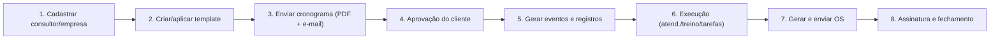

# Guia Operacional — Fluxo Resumido

**Objetivo:** guia curto e acionável para coordenadores e consultores.
**Público:** Coordenador de Atendimento, Consultor, Suporte Técnico.

---

## Fluxo visual

---

## Fluxo principal (resumido)

1. Cadastrar consultor e empresa.
2. Criar (ou aplicar) template → montar cronograma.
3. Enviar cronograma para aprovação (PDF/Excel + e-mail).
4. Cliente aprova → cronograma confirmado e bloqueado.
5. Sistema gera eventos e registros; execução começa.
6. Registrar atendimentos/treinamentos/tarefas; gerar OS quando necessário.
7. Gerar e enviar OS (PDF + e-mail/WhatsApp); marcar como assinada.

---

## Ações por papel

| Papel | Ações principais |
|---|---|
| **Coordenador** | Cadastrar consultores/empresas, criar templates, revisar cronogramas, enviar para cliente |
| **Consultor** | Confirmar disponibilidade, executar treinamentos, registrar horas, gerar OS |
| **Cliente** | Aprovar cronogramas, confirmar horários, assinar OS via link público |

---

## Onde encontrar mais detalhes

- **Visão completa do sistema e regras de negócio:** [../DOC_01_VISAO_GERAL.md](../DOC_01_VISAO_GERAL.md)
- **Arquitetura e referência técnica:** [../DOC_02_ARQUITETURA_E_REFERENCIA_TECNICA.md](../DOC_02_ARQUITETURA_E_REFERENCIA_TECNICA.md)
- **Fluxo de implantação detalhado (passo a passo):** [FLUXO_AGENDAMENTO_IMPLANTACAO.md](FLUXO_AGENDAMENTO_IMPLANTACAO.md)
