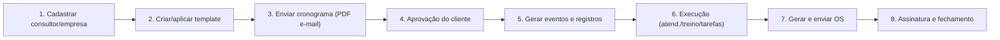

# Guia Operacional — Fluxo Resumido

Objetivo: fornecer um guia curto e acionável para coordenadores e consultores, com links para documentação técnica detalhada.

Público: Coordenador de Atendimento, Consultor, Suporte Técnico.

  

## Visual rápido

- ✅ Leitura inicial: siga os passos do diagrama abaixo.
- 🧭 Público: coordenador → consultor → cliente.

Sumário rápido
- Propósito e papéis
- Fluxo principal (resumido)
- Principais ações por papel
- Links rápidos para documentação detalhada

Fluxo principal (resumido)
1. Cadastrar consultor e empresa.
2. Criar (ou aplicar) template → montar cronograma.
3. Enviar cronograma para aprovação (PDF/Excel + e-mail).
4. Cliente aprova → cronograma confirmado e bloqueado.
5. Sistema gera eventos e registros; execução começa.
6. Registrar atendimentos/treinamentos/tarefas; gerar OS quando necessário.
7. Gerar e enviar OS (PDF + e-mail/WhatsApp); marcar como assinada.

Ações rápidas por papel
- Coordenador: cadastrar consultores/empresas, criar templates, revisar cronogramas, enviar para cliente.
- Consultor: confirmar disponibilidade, executar treinamentos, registrar horas, gerar OS.
- Cliente: aprovar cronogramas, confirmar horários, assinar OS.

Onde encontrar detalhes
- Fluxo mestre: [FLUXO_AGENDAMENTO_IMPLANTACAO.md](FLUXO_AGENDAMENTO_IMPLANTACAO.md#L1)
- Visual e estilos: [docs/01_visual_e_estilos.md](docs/01_visual_e_estilos.md#L1)
- Componentes: [docs/02_componentes_utilizados.md](docs/02_componentes_utilizados.md#L1)
- Lógicas e validações: [docs/03_logicas_e_validacoes.md](docs/03_logicas_e_validacoes.md#L1)
- Fluxo de código (visão geral): [docs/04_fluxo_codigo_geral.md](docs/04_fluxo_codigo_geral.md#L1)
- Estrutura de dados / DB: [docs/08_estrutura_banco_de_dados.md](docs/08_estrutura_banco_de_dados.md#L1)
 - Estrutura de dados / DB (modelo Postgres sugerido): [docs/09_estrutura_banco_de_dados.md](docs/09_estrutura_banco_de_dados.md#L1)
- Índice navegável: [INDEX.md](INDEX.md) — sumário por público (Operação / Dev / QA).

Sugestões de uso
- Ler este guia antes de abrir o fluxo mestre completo.
- Usar os arquivos em `docs/` como referência quando precisar de detalhes técnicos ou tabelas.
- Ao documentar alterações, preferir atualizar o arquivo técnico específico em `docs/` e linkar aqui.

Próximos artefatos recomendados
- `docs/ACCEPTANCE_CHECKLISTS.md` — checklists por tela para QA/aceitação.
